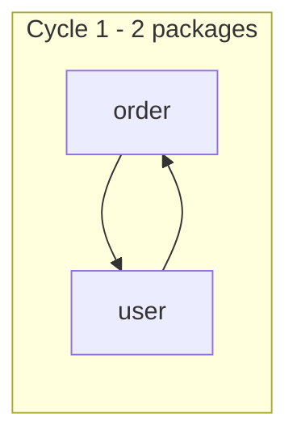

# dependency-visualizer

A Gradle plugin that detects **circular dependencies** in Java projects and visualizes them as **Mermaid / HTML** diagrams.

When you catch circular references with tools like ArchUnit, you often get dozens or hundreds of them dumped as text — impossible to read. Instead of listing every individual cycle, this plugin **groups them into strongly connected components (SCCs)** and **aggregates at the package level**, so you can see *what is tangled with what* at a glance.

## Requirements

- **Gradle** 8.0+ (developed and verified on 9.0.0)
- **JDK 17+** — the plugin is shipped as Java 17 bytecode, so the JVM running Gradle must be 17 or newer.
- Analysis target: plain Java (Spring / Lombok are fine). Kotlin is not supported.

## Apply

```kotlin
// build.gradle.kts
plugins {
    java
    id("io.github.minsun0714.dependency-visualizer") version "0.1.3"
}
```

Groovy DSL (`build.gradle`):

```groovy
plugins {
    id 'java'
    id 'io.github.minsun0714.dependency-visualizer' version '0.1.3'
}
```

For a standard Java project it works with **zero configuration**. The source root is taken from the `main` source set automatically, and the internal-type filter (`basePackage`) is inferred from the common top-level package of your sources.

## Usage

```bash
./gradlew visualizeDependencies
```

This generates three files under `build/reports/depvis/`:

| File | Description |
|------|-------------|
| `cycles.html` | Viewer rendering both package- and class-level diagrams (open in a browser) |
| `cycles-package.mmd` | Package-level Mermaid text |
| `cycles-class.mmd` | Class-level Mermaid text |

Just open `cycles.html` in a browser. (The diagram loads mermaid.js from a CDN, so an internet connection is needed to view it.)

## Configuration (optional)

Only needed when you want to override the defaults. All three are optional.

```kotlin
dependencyVisualizer {
    basePackage = "com.acme"                                    // internal-type filter; inferred from sources if omitted
    sourceRoot = layout.projectDirectory.dir("src/main/java")   // source root to analyze; main source set if omitted
    outputDir = layout.buildDirectory.dir("reports/depvis")     // report output directory
}
```

## Understanding the output

Results are shown at two levels.

- **Package level (default view)** — class edges are collapsed into their packages, and **intra-package cycles are excluded**. Only cycles that cross package boundaries remain, which greatly reduces noise.
- **Class level (drill-down)** — the original class-granularity cycles, for finding exactly which classes are tangled.

Node labels are shown as a **path relative to the common top-level package** (e.g. `auth.security`, `shared.exception`) — so packages that share the same leaf name (`shared.exception` vs `warranty.exception`) stay distinguishable.

For example, if package `order` and package `user` reference each other, the package level looks like this:



## How it works

A five-stage pipeline:

1. **Parse** — extract class-to-class dependency edges with JavaParser + SymbolSolver
2. **Filter** — keep only internal types starting with `basePackage` (JDK / third-party libraries are noise and excluded)
3. **Aggregate** — roll class edges up to the package level (dropping intra-package edges)
4. **Detect cycles** — find SCCs (strongly connected components) with Tarjan's algorithm, avoiding the combinatorial explosion of enumerating every individual cycle
5. **Render** — Mermaid text + HTML viewer

### What counts as a "dependency"

An edge is recorded when a class references an internal type through any of:

- Fields (field injection, including Lombok `@RequiredArgsConstructor`)
- Constructor parameters (standard constructor injection)
- Method signatures (parameter + return types)
- Inheritance / implementation (`extends`, `implements`)
- Object creation (`new Xxx()`)
- Generic type arguments of all of the above (e.g. `Order` in `List<Order>`)

## Limitations

- Dependencies via static method calls, annotations, or local variables are not yet captured.
- Package calculation can be inaccurate in codebases with many nested classes.
- SCC detection may hit the recursion stack limit on very deep (thousands of levels) graphs.

## Development

```bash
./gradlew :analyzer:test :gradle-plugin:test   # run all tests
./gradlew :analyzer:run                        # demo run against the sample project
./gradlew :gradle-plugin:publishToMavenLocal   # publish locally (for verification)
```

Multi-module layout: `analyzer` (analysis pipeline library) + `gradle-plugin` (the plugin) + `sample-project` (cyclic samples for testing).

## License

[MIT](LICENSE) © minsun0714
