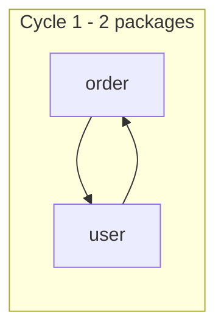

# dependency-visualizer

Java 프로젝트의 **순환 의존(circular dependency)** 을 검출해 **Mermaid / HTML** 로 시각화하는 Gradle 플러그인.

ArchUnit 등으로 순환참조를 잡으면 수십~수백 개가 쏟아져 눈으로 읽기 어렵습니다. 이 플러그인은 개별 순환을 모두 나열하는 대신 **강결합요소(SCC) 단위로 묶고**, **패키지 레벨로 집계**해 "무엇이 어떻게 얽혀 있는지"를 한눈에 보여줍니다.

> ⚠️ 현재 Gradle Plugin Portal **최초 승인 대기 중**입니다. 승인 후 아래 사용법이 동작합니다.

## 요구사항

- **Gradle** 8.0+ (9.0.0 에서 개발·검증)
- **JDK 17+** — 플러그인이 Java 17 바이트코드로 배포되므로 Gradle 을 실행하는 JVM 이 17 이상이면 됩니다.
- 분석 대상: 순수 Java (Spring / Lombok 사용 무방). Kotlin 은 대상 아님.

## 적용

```kotlin
// build.gradle.kts
plugins {
    java
    id("io.github.minsun0714.dependency-visualizer") version "0.1.3"
}
```

Groovy DSL(`build.gradle`)이면:

```groovy
plugins {
    id 'java'
    id 'io.github.minsun0714.dependency-visualizer' version '0.1.3'
}
```

표준 Java 프로젝트면 **설정 0줄**로 동작합니다. 소스 루트는 `main` sourceSet 에서 자동으로 잡고, 내부 타입 필터(`basePackage`)는 소스의 공통 최상위 패키지를 추론합니다.

## 사용

```bash
./gradlew visualizeDependencies
```

실행하면 `build/reports/depvis/` 에 세 파일이 생성됩니다:

| 파일 | 설명 |
|------|------|
| `cycles.html` | 패키지·클래스 두 레벨 다이어그램을 함께 보는 뷰어 (브라우저로 열기) |
| `cycles-package.mmd` | 패키지 레벨 Mermaid 텍스트 |
| `cycles-class.mmd` | 클래스 레벨 Mermaid 텍스트 |

`cycles.html` 을 브라우저로 열면 끝입니다. (다이어그램은 mermaid.js 를 CDN 에서 불러오므로 열람 시 인터넷 필요)

## 설정 (선택)

기본값을 바꾸고 싶을 때만 씁니다. 셋 다 생략 가능합니다.

```kotlin
dependencyVisualizer {
    basePackage = "com.acme"                      // 내부 타입 필터. 생략 시 소스에서 자동 추론
    sourceRoot = layout.projectDirectory.dir("src/main/java")  // 분석 소스 루트. 생략 시 main sourceSet
    outputDir = layout.buildDirectory.dir("reports/depvis")  // 리포트 출력 경로
}
```

## 출력 이해하기

두 레벨로 결과를 보여줍니다.

- **패키지 레벨 (기본 뷰)** — 클래스 간선을 소속 패키지로 접고, **같은 패키지 내부 순환은 제외**합니다. 패키지 경계를 넘나드는 진짜 구조적 순환만 남아 노이즈가 크게 줄어듭니다.
- **클래스 레벨 (드릴다운)** — 원본 클래스 단위 순환. 어떤 클래스가 얽혔는지 파고들 때 봅니다.

노드 라벨은 공통 최상위 패키지를 뗀 **상대 경로**로 표시됩니다(예: `auth.security`, `shared.exception`) — 끝조각이 같은 패키지(`shared.exception` vs `warranty.exception`)도 구분됩니다.

예를 들어 `order` 패키지와 `user` 패키지가 서로 참조하면 패키지 레벨에 이렇게 나옵니다:



## 동작 원리

5단계 파이프라인입니다.

1. **파싱** — JavaParser + SymbolSolver 로 클래스 → 클래스 의존 간선 추출
2. **필터** — `basePackage` 로 시작하는 내부 타입만 채택 (JDK / 외부 라이브러리는 노이즈라 제외)
3. **집계** — 클래스 간선을 패키지 단위로 롤업 (내부 간선 제거)
4. **순환 검출** — Tarjan 알고리즘으로 SCC(강결합요소) 검출. 개별 순환을 모두 나열하지 않아 조합 폭발을 피함
5. **출력** — Mermaid 텍스트 + HTML 뷰어

### 무엇을 "의존" 으로 보는가

한 클래스에서 아래 경로로 내부 타입을 참조하면 간선으로 잡습니다.

- 필드 (필드 주입, Lombok `@RequiredArgsConstructor` 포함)
- 생성자 파라미터 (표준 생성자 주입)
- 메서드 시그니처 (파라미터 + 반환 타입)
- 상속 / 구현 (`extends`, `implements`)
- 객체 생성 (`new Xxx()`)
- 위 모든 타입의 제네릭 인자 (`List<Order>` 의 `Order` 등)

## 제한사항

- 정적 메서드 호출·애노테이션·지역 변수 등을 통한 의존은 아직 잡지 않습니다.
- 중첩 클래스가 많은 코드베이스에서는 패키지 계산이 부정확할 수 있습니다.
- 매우 깊은(수천 depth) 그래프에서는 SCC 검출이 재귀 스택 한계에 닿을 수 있습니다.

## 개발

```bash
./gradlew :analyzer:test :gradle-plugin:test   # 전체 테스트
./gradlew :analyzer:run                        # 샘플 프로젝트로 데모 실행
./gradlew :gradle-plugin:publishToMavenLocal   # 로컬 게시(검증용)
```

멀티모듈 구성: `analyzer`(분석 파이프라인 라이브러리) + `gradle-plugin`(플러그인) + `sample-project`(테스트용 순환 샘플).

## 라이선스

[MIT](LICENSE) © minsun0714
